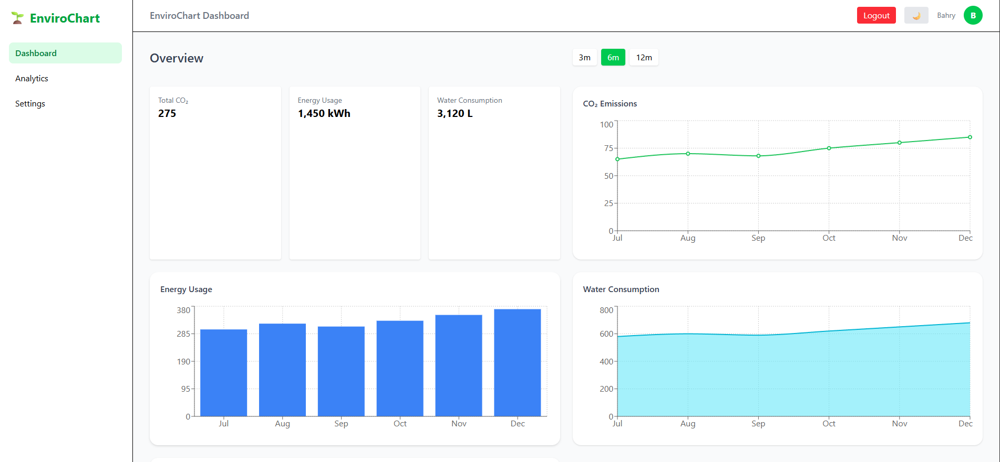
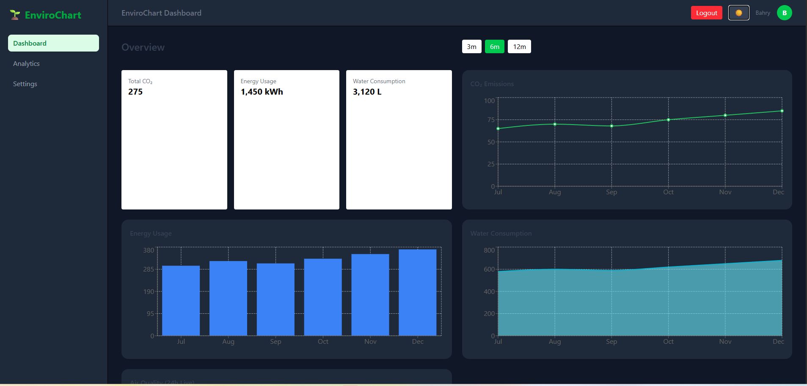
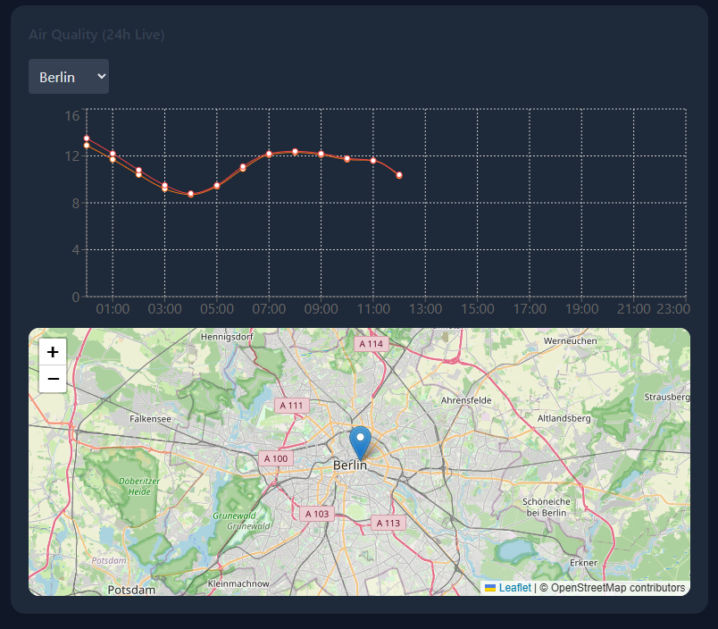

# 🌱 EnviroChart Dashboard

A modern environmental dashboard for visualizing air quality and sustainability metrics.

## 🚀 Features

- 📊 Interactive charts (CO₂, Energy, Water)
- 🌍 Real-time air quality data (API integration)
- 🗺 Map visualization with city selection
- 🔐 Authentication with protected routes
- 🌙 Dark mode support
- 📱 Fully responsive design

## 🛠 Tech Stack

- React + TypeScript
- Vite
- TailwindCSS
- Recharts
- React Leaflet

## 🌍 Live Demo

👉 https://enviro-chart-dashboard.vercel.app/

## 📸 Screenshots

### Dashboard



### Dark Mode



### Map + Air Quality



## 📦 Installation

```bash
npm install
npm run dev
```
